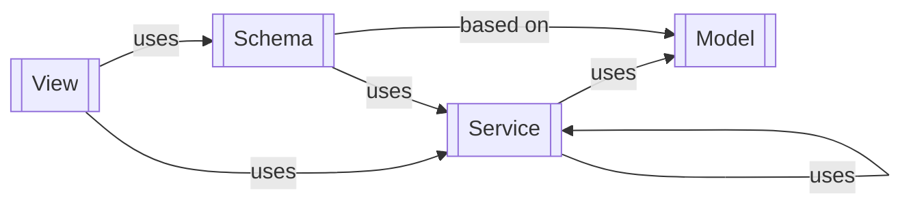

Цель
====

Реализовать web service, который предоставляет функциональность касательно toast сообщений:

* endpoint который получает системные toast сообщения:

* endpoint который отмечает системное(ые) toast сообщение(я) как прочитанные:

** принимает на вход id сообщения

* endpoint который получает пользовательские toast сообщения:

** принимает на вход id пользователя

* endpoint который отмечает пользовательское(ие) toast сообщение(я) как прочитанные:

** принимает на вход id пользователя
** принимает на вход id сообщения

* endpoint который позволяет создать toast собщение:

** принимает текст
** принимает id пользователя, опциональное поле, если None, то считаем, что создаем системное сообщение
** в ответ отправляет текст, id пользователя (либо null), id сообщения

Реализованный web service должен быть покрыт unit-тестами (правильнее integration тестами, конечно было бы сказать):

* тестовый запрос должен отправляться в test instance - https://flask.palletsprojects.com/en/stable/testing/
* ответ должен быть провалидирован на корректность его структуры (есть нужные поля) а так же на корректность значений

Структура приложения должна соотвествовать приведенным на схеме высокоуровневым модулям, включая зависимсоти между ними

- View (может быть package с вложенными модулями) - должен содержать описание endpoint(s), а так же схемы для валидации/сериализации, а так же вызов к бизнес-логике (Service)
- Service (может быть package с вложенными модулями) - должен содержать бизнес-логику, в частности обращения к БД
- Schema (может быть package с вложенными модулями) - должен содержать описание схемы для валидации/сериализации

Приложение должно содержать все необходимые миграции БД, а так же работать локально используя sqlite БД. 

Предположения
-----

* предполгаем, что пользователи в БД уже откуда-то там взялись, поэтому просто должна быть таблица, аля Users с добавлеными туда, через миграцию БД, парочкой пользователей

Стек
-----

Для реализации используем:

* flask_restx - для самого web service
* sqlalchemy - для работы с БД
* marshmallow - для валидации входных данных и сериализации результата

** marshmallow-sqlachemy - для автогенерации схем валидации на базе моделей БД
** marshmallow-dataclass - для сериализации обьектов, которые не являются моделями БД

* pytest - для тестов
* tox - для запуска unit-тестов

